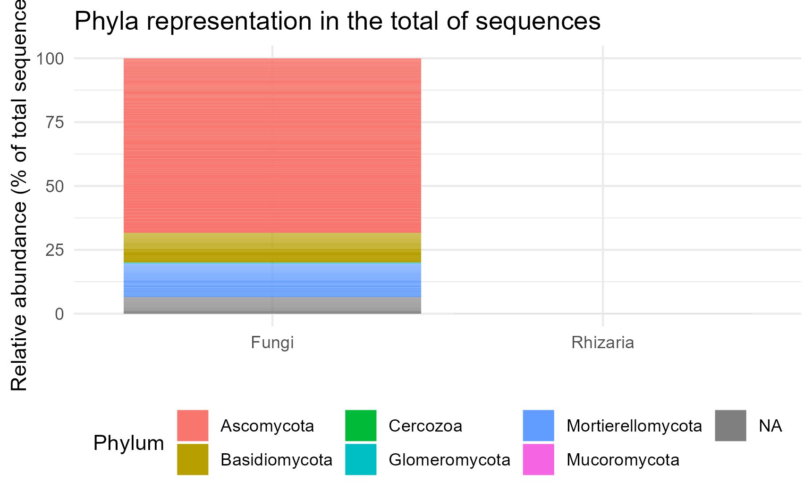
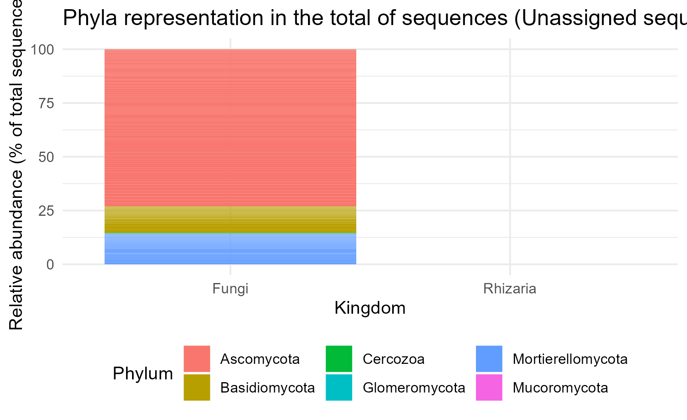
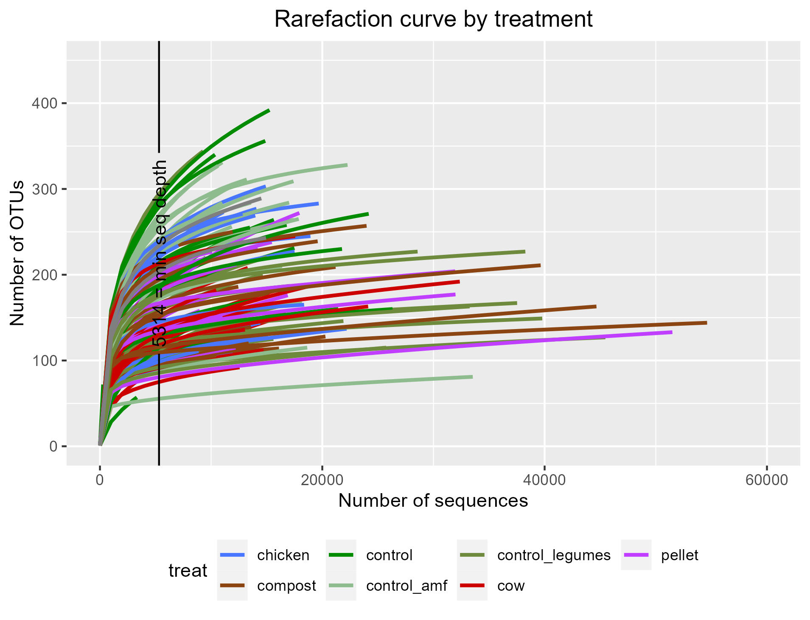
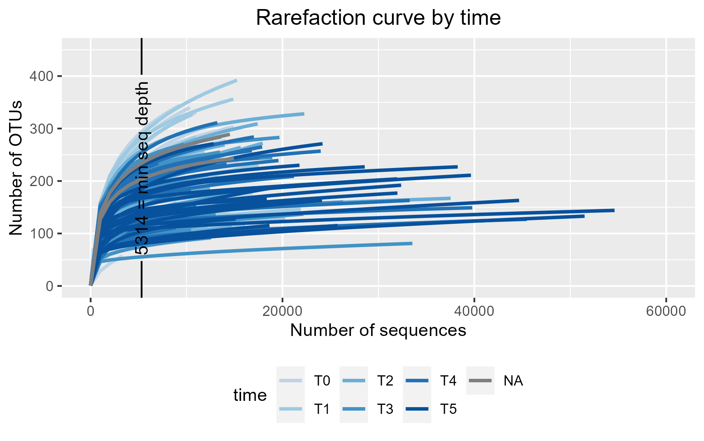
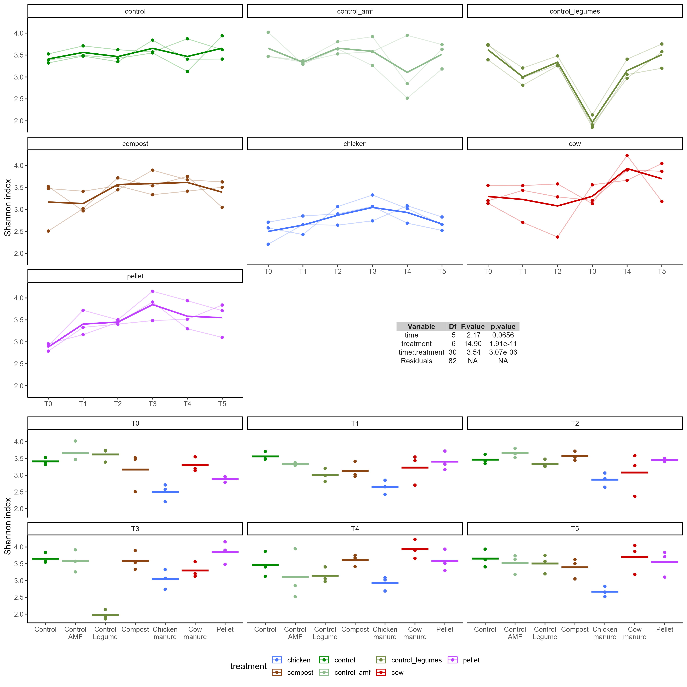
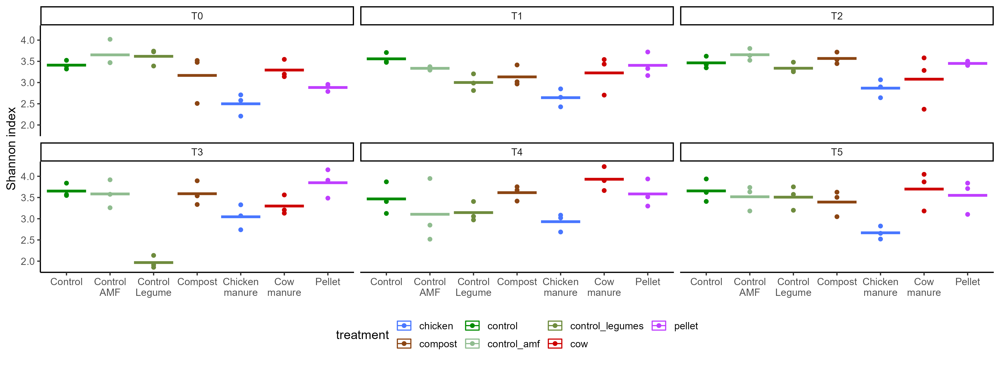
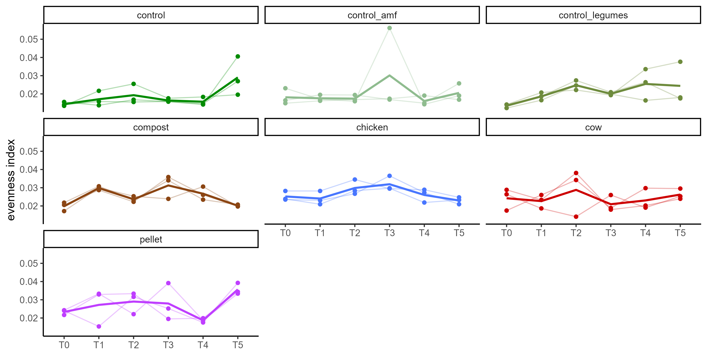
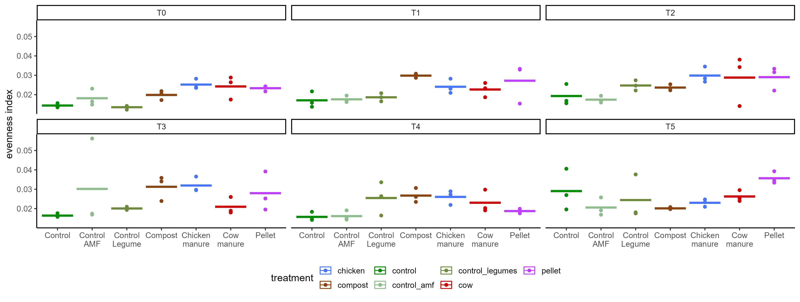
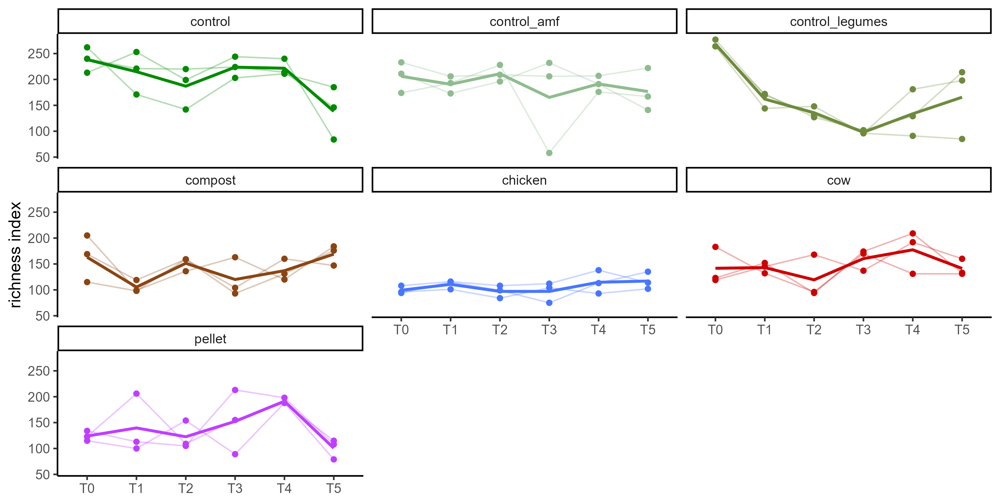
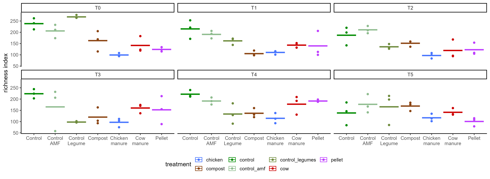

```{r setup, include=FALSE}
knitr::opts_chunk$set(include = FALSE)
```

```{r libraries, include=FALSE}
library(readxl)
library(agricolae)
library(tidyr)
library(tidyverse)
library(ggpubr)
library(rstatix)
library(MASS)
library(dplyr)
library(dunn.test)
library(corrplot)
library(gridExtra)
library(phyloseq)
library(vegan)
library(here)
library(geomtextpath)
```


```{r colors and order, include=FALSE}
treat.colors <- c("control"= "green4" ,"control_amf"  = "darkseagreen" , "chicken"= "royalblue1", "cow" = "red3","pellet"= "darkorchid1","compost"="chocolate4","control_legumes"="darkolivegreen4")
time.colors <- c("T0"="#66c2a5", "T1"="#fc8d62", "T2"="#8da0cb", "T3"="#e78ac3", "T4"="#a6d854", "T5"="#ffd92f")
time.colors <- c("T0"="#BFD3E6", "T1"="#9ECAE1", "T2"="#6BAED6", "T3"="#4292C6", "T4"="#2171B5", "T5"="#08519C")
 time.colors <- c("#BFD3E6", "#9ECAE1", "#6BAED6", "#4292C6", "#2171B5", "#08519C")


treat.order <- c('control', 'control_amf', 'control_legumes', "compost", "chicken", "cow", "pellet") 
treat.labels <- c("Control", "Control\nAMF", "Control\nLegume", "Compost", "Chicken\nmanure", "Cow\nmanure", "Pellet")
```

```{r import data}
import <- here("ITS_banana", "p1031_run231023_ITS_ccs_ZOTU_c97_Count_Sintax.txt")
zotu97 <- import_qiime(otufilename= import)
metadata <- read_delim(file= here("ITS_banana","metadata.csv" ),show_col_types = FALSE) %>% 
  column_to_rownames(var= "sample_name")

zotu97 <- merge_phyloseq(zotu97, sample_data(metadata))
```

```{r phylum with NA}
kingdom_list <- tax_table(zotu97) %>% as.data.frame() %>% pull(Kingdom)
phylum_list <- tax_table(zotu97) %>% as.data.frame() %>% pull(Phylum) %>% na.omit() %>% unique()

#Get all the otus with unknown phylum
unknown_seqs <- tax_table(zotu97) %>% as.data.frame()
unknown_seqs <-unknown_seqs[is.na(unknown_seqs$Phylum),]
nrow(unknown_seqs)
nrow(tax_table(zotu97))
unknown_OTUs <- row.names(unknown_seqs) %>% as.vector()

numFungi <- kingdom_list[kingdom_list== "Fungi"] %>% length()
notFungi <- kingdom_list[!kingdom_list== "Fungi"] %>% length()

num_unknown <- unknown_seqs %>% dplyr::count() %>% as.vector() 
```

The dataset contains `r numFungi` sequences that belong to the Fungi Kingdom and `r notFungi` sequences that are not Fungi but Rhizaria (Phylum Cercozoa)


```{r Phyla with NA , echo=FALSE}

dat_merge_all_tax <- tax_glom(physeq = zotu97, "Phylum", NArm = FALSE)
molten_dat_all_merge <- psmelt(dat_merge_all_tax)
p_phyla_NA <- ggplot(molten_dat_all_merge, 
                  aes(x=Kingdom, y = Abundance/sum(Abundance)*100,fill=Phylum)) + 
  geom_col() +
  xlab("") + 
  ylab("Relative abundance (% of total sequences)") +
   theme_minimal() +
  ggtitle("Phyla representation in the total of sequences")+
  #theme(axis.text.x=element_blank(), axis.title.x=element_blank())+
  theme(legend.position="bottom")
p_phyla_NA
ggsave(p_phyla_NA, file= "ITS_results/phyla_NA.png")
```

```{r, Phyla without NA, echo= FALSE}
dat_merge_all_tax <- tax_glom(physeq = zotu97, "Phylum", NArm = TRUE)
molten_dat_all_merge <- psmelt(dat_merge_all_tax)
p_phyla <- ggplot(molten_dat_all_merge, 
                  aes(x = Kingdom,y = Abundance/sum(Abundance)*100,fill=Phylum)) + 
  geom_col() +
  xlab("Kingdom") + 
  ylab("Relative abundance (% of total sequences)") +
   theme_minimal() +
  ggtitle("Phyla representation in the total of sequences (Unassigned sequences removed)")+
  #theme(axis.text.x=element_blank(), axis.title.x=element_blank())+
  theme(legend.position="bottom")
p_phyla
ggsave(p_phyla, file= "ITS_results/phyla.png")
```





```{r Sequencing depth z97 , include=FALSE}

seqdepth97 <- colSums(otu_table(zotu97)) #get the number of sequences(or reads) per sample
sample.table97 <- sample_data(zotu97)
sample.table97 <- cbind(seq.depth= seqdepth97, sample.table97) #binds the number of sequences per sample to the sample data that also contains the metadata. This allows to filter all the data according to experiment, repetition, treatment...


```

```{r plot Sequences per sample z97, echo=FALSE, message=FALSE, warning=FALSE}
summary(aov(seq.depth~treatment, data = sample.table97))
summary(aov(seq.depth~time, data = sample.table97))

plot.seq.depth.treat <- sample.table97 %>% 
 ggplot(aes(x = factor(treatment, level= treat.order), y = seq.depth, col= treatment)) +
  geom_boxplot()+
  theme(legend.position="bottom")+
  labs(y= "N.sequences", x= "Treatment", title = "Sequencing depth of the different treatments and soils")+
  scale_color_manual(values= treat.colors)+
  scale_x_discrete(labels= treat.labels)+
  theme_classic2()
plot.seq.depth.treat

plot.seq.depth.time <- sample.table97 %>% 
 ggplot(aes(x = time, y = seq.depth, col= time)) +
  geom_boxplot(outlier.colour = NA)+
  theme(legend.position="bottom")+
  scale_color_manual(values= time.colors)+
  labs(y= "N.sequences", x= "Time", title = "Sequencing depth of the different treatments and soils")+
  theme_classic2()
plot.seq.depth.time


```

As seen in the graphs above, there is uneven sequencing depth among treatments (Wilcoxon test on the means of the sequencing depth of the treatments), this might lead to differences in the representation of the samples. This can also be visualized with the use of rarefaction plots. 

### Rarefaction plots {.tabset}

```{r  Rarefaction zOTU97, include=FALSE}
trans_zotu97 <- t(otu_table(zotu97)) %>% data.frame() #transpose the otu table
rarecurve97 <- rarecurve(trans_zotu97, step=1000, xlab= "number of sequences", ylab="number of OTUs", label = FALSE, col= 2)
plot_rare <- rarecurve97 %>% 
  purrr::map(~ tibble(
    y = as.vector(.x),
    x = unname(attr(.x, "Subsample")),
    steps = names(.x))) %>%
  tibble(data = ., sample = seq_along(.)) %>%
  unnest(data)

stopifnot(identical(sort(unique(plot_rare$sample)), 1:NROW(sample.table97))) #plot_data$sample and sample_data(zotu97) must be identical
sample.table97 <- sample.table97[sample.table97$treatment != "NTC", ] %>% .[.$treatment != "CTL", ]
zotu97 <- subset_samples(zotu97, treatment != "NTC" & treatment != "CTL")
plot_rare$treat <- (sample.table97$treatment)[plot_rare$sample]
plot_rare$time <- (sample.table97$time)[plot_rare$sample]

pp_treat <- plot_rare %>% 
  ggplot() +
  geom_line(aes(x,y, color = treat, group = sample),lwd= 1) +
   theme(legend.position = "bottom",plot.title = element_text(hjust = 0.5))+
  ylab("Number of OTUs")+
  xlab("Number of sequences") +
  ggtitle("Rarefaction curve by treatment")+
  geom_textvline(xintercept = min(sample.table97$seq.depth), label = paste(min(sample.table97$seq.depth), "= min seq depth"))+
  coord_cartesian(xlim = c(0, 60000), ylim = c(0, 450))+scale_color_manual(values= treat.colors)
pp_treat
ggsave(pp_treat, file= "ITS_results/rare_treat.png")

pp_time <- plot_rare %>% 
  ggplot() +
  geom_line(aes(x,y, color = time, group = sample),lwd= 1) +
   theme(legend.position = "bottom",plot.title = element_text(hjust = 0.5))+
  ylab("Number of OTUs")+
  xlab("Number of sequences") +
  ggtitle("Rarefaction curve by time")+
  geom_textvline(xintercept = min(sample.table97$seq.depth), label = paste(min(sample.table97$seq.depth), "= min seq depth"))+
  coord_cartesian(xlim = c(0, 60000), ylim = c(0, 450))+scale_color_manual(values= time.colors)
pp_time
ggsave(pp_time, file= "ITS_results/rare_time.png")


rarefaction_curves <- grid.arrange(pp_treat, pp_time, nrow=2)
```

#### Rarefaction plot by treatment



#### Rarefaction plot by soil




## Rarefy the data

A way to fight the differences in the sequencing depth is rarefying the data. This statistical process randomly samples the same number of sequences, obtaining a higher fidelity of representation of the taxa composition of each sample. It is performed in loop for a high number of times (500, for example) so that the random choice of taxa is warrantied.

The following code chunk performs rarefaction 500 times, then it calculates the Shannon index (as the negative sum of all the frequencies times the logarithm of the frequencies), the richness and the evenness with the average abundances resulting of those 500 iterations. To avoid wasting time, the results are saved to an object and loaded in a separate chunk.

```{r 500 rarefaction loop, eval=FALSE, include=FALSE}
#My own shannon function
shannon.iro <- function(x){
 fi <- x[x>0]/sum(x) #frequency of species "i" is equal to count (if > 0) divided by the sum of all counts
  -sum(fi*log(fi)) #shannon index is the negative of the sum of all the frequencies of all the species times the log of those species
}
#create empty vectors
richness_500 <- c()
diversity_500 <- c()
even_500 <- c()
for (i in 1:500){
 #generate rarefied community
 temp_500 <-  rarefy_even_depth(otu_table(zotu97), rngseed = 22081998, sample.size = min(sample.table97$seq.depth))
#  richness is species number
 s <- specnumber(temp_500, MARGIN=2)
richness_500 <- cbind(richness_500,s)
  
  #diverasity uses my own formula
shannon<- apply(temp_500,2, shannon.iro)
diversity_500 <- cbind(diversity_500,shannon)
 #evenness
j <- shannon/s
 even_500 <- cbind(even_500,j)
} 

#calculate means of subsamples
shannon <- rowMeans(diversity_500)
richness <- rowMeans(richness_500)
evenness <- rowMeans(even_500)

# put them all in one dataframe
summary_diversity_rar <- data.frame( cbind( shannon, richness, evenness))
stopifnot(identical(rownames(sample_data(zotu97)), names(richness)))

sample.table97.500<- cbind(summary_diversity_rar, sample_data(zotu97))
save(sample.table97.500, file=here("ITS_banana", "sample.table97.500.Rdata"))
#save the results of the loop in an object to avoid wasting time in each run, if needed to re-run, change the chunk option to "eval= TRUE"
```


```{r Load the rarefying loop, include = FALSE}
load(here("ITS_banana",  "sample.table97.500.Rdata"))

#merge this rarefied data with a phyloseq object
zotu97.rar <- merge_phyloseq(zotu97, sample_data(sample.table97.500))
# zotu97.rar contains the samples, the experimental variables and the alpha diversity indexes resulting of the rarefying loop.
```

```{r, include= TRUE}
zotu97
zotu97.rar
```


## Alpha diversity {.tabset}

### Shanon

```{r shannon}
data <- sample_data(zotu97.rar)


shannon_treat_facet <- data %>% ggplot(aes(x= factor(treatment, level= treat.order), y= shannon, color= time)) +
  geom_point()+
  scale_color_manual(values= time.colors)+
  facet_wrap(~time)+
  theme_classic2()+
  scale_x_discrete(labels= treat.labels) 
shannon_treat_facet
ggsave(shannon_treat_facet, file= "ITS_results/shannon_treat_facet.png", width = 4000, unit= "px")


shannon_time_facet <- data %>% ggplot(aes(x= time, y= shannon, color= treatment, group = 1)) +
  geom_point()+
  scale_color_manual(values= treat.colors)+
  geom_smooth(aes(col= treatment), method = "lm", se = FALSE, size = 1) + 
  facet_wrap(~factor(treatment, level= treat.order))+
  theme_classic2()
ggsave(shannon_time_facet, file= "ITS_results/shannon_time_facet.png", width = 3000, unit= "px")
shannon_time_facet

data %>% ggplot(aes(x= treatment, y= shannon, color= time, group= time)) +
  geom_point()+
  scale_color_manual(values= time.colors)+
  scale_fill_manual(values= time.colors)+
  geom_smooth(aes(color= time, fill= time), alpha= 0, method= "lm")+
  theme_classic2()+
  scale_x_discrete(labels= treat.labels)

data %>% ggplot(aes(x= time, y= shannon, color= treatment)) +
  geom_point()+
  scale_color_manual(values= treat.colors)+
  scale_fill_manual(values= treat.colors)+
  theme_classic2()
```




### Evenness

```{r evenness}
data <- sample_data(zotu97.rar)

evenness_treat_facet <- data %>% ggplot(aes(x= treatment, y= evenness, color= time)) +
  geom_point()+
  scale_color_manual(values= time.colors)+
  facet_wrap(~time)+
  theme_classic2()+
  scale_x_discrete(labels= treat.labels)
ggsave(evenness_treat_facet, file= "ITS_results/evenness_treat_facet.png", width = 4000, unit= "px")
evenness_treat_facet

evenness_time_facet <- data %>% ggplot(aes(x= time, y= evenness, color= treatment, group = 1)) +
  geom_point()+
  scale_color_manual(values= treat.colors)+
  geom_smooth(aes(col= treatment), method = "lm", se = FALSE, size = 1) + 
  facet_wrap(~factor(treatment, level= treat.order))+
  theme_classic2()
ggsave(evenness_time_facet, file= "ITS_results/evenness_time_facet.png", width = 3000, unit= "px")
evenness_time_facet

data %>% ggplot(aes(x= treatment, y= evenness, color= time, group= time)) +
  geom_point()+
  scale_color_manual(values= time.colors)+
  scale_fill_manual(values= time.colors)+
  geom_smooth(aes(color= time, fill= time), alpha= 0, method= "lm")+
  theme_classic2()+
  scale_x_discrete(labels= treat.labels)

data %>% ggplot(aes(x= time, y= evenness, color= treatment, group= treatment)) +
  geom_point()+
  scale_color_manual(values= treat.colors)+
  theme_classic2()+
  geom_smooth(aes(color= treatment), alpha= 0, method= "lm")

```




### Richness

```{r richness}
data <- sample_data(zotu97.rar)

richness_treat_facet <- data %>% ggplot(aes(x= treatment, y= richness, color= time)) +
  geom_point()+
  scale_color_manual(values= time.colors)+
  facet_wrap(~time)+
  theme_classic2()+
  scale_x_discrete(labels= treat.labels)

ggsave(richness_treat_facet, file= "ITS_results/richness_treat_facet.png", width = 4000, unit= "px")

richness_time_facet <- data %>% ggplot(aes(x=time, y= richness, color= treatment, group = 1)) +
  geom_point()+
  scale_color_manual(values= treat.colors)+
  geom_smooth(aes(col= treatment), method = "lm", se = FALSE, size = 1) + 
  facet_wrap(~factor(treatment, level= treat.order))+
  theme_classic2()
richness_time_facet
ggsave(richness_time_facet, file= "ITS_results/richness_time_facet.png", width = 3000, unit= "px")

data %>% ggplot(aes(x= treatment, y= richness, color= time, group= time)) +
  geom_point()+
  scale_color_manual(values= time.colors)+
  scale_fill_manual(values= time.colors)+
  geom_smooth(aes(color= time, fill= time), alpha= 0, method= "lm")+
  theme_classic2()+
  scale_x_discrete(labels= treat.labels)

data %>% ggplot(aes(x= time, y= richness, color= treatment, group= treatment)) +
  geom_point()+
  scale_color_manual(values= treat.colors)+
  theme_classic2()+
  geom_smooth(aes(color= treatment), alpha= 0, method= "lm")
```





Missing stats