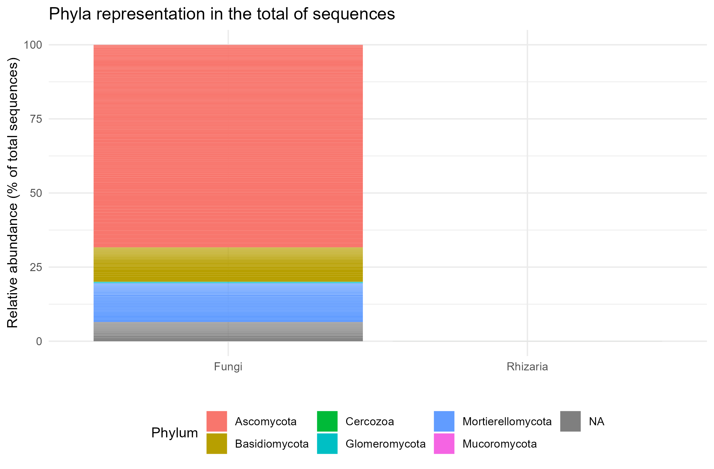
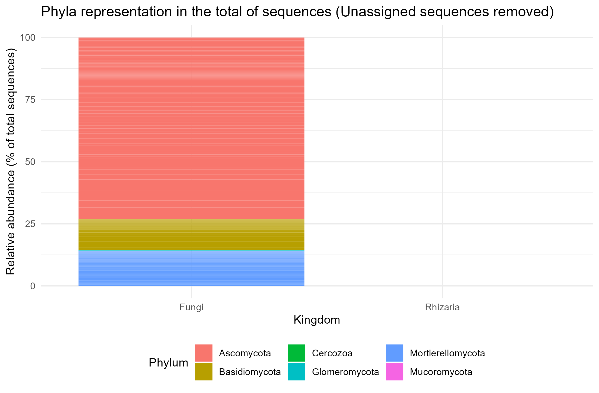
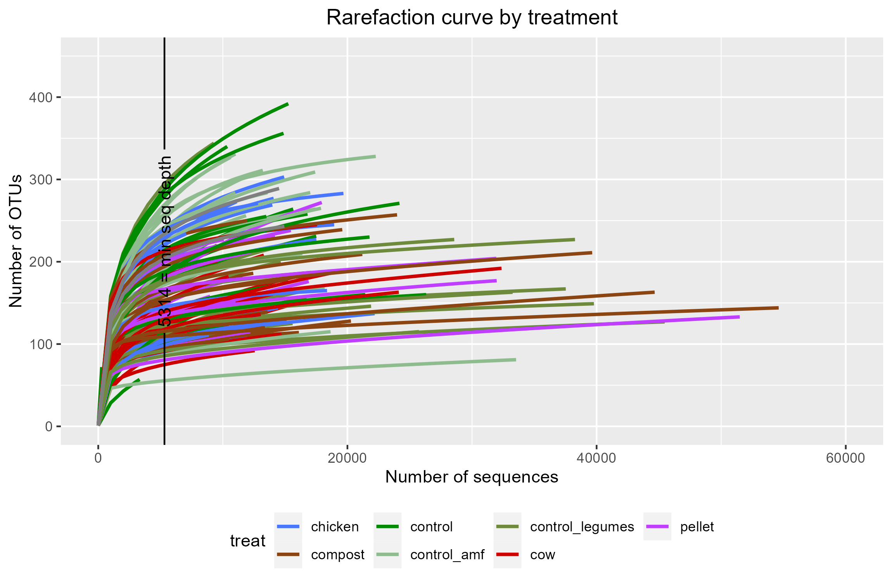
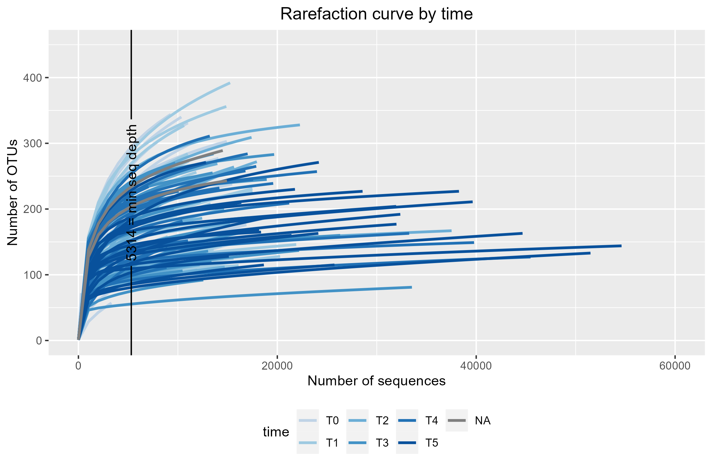
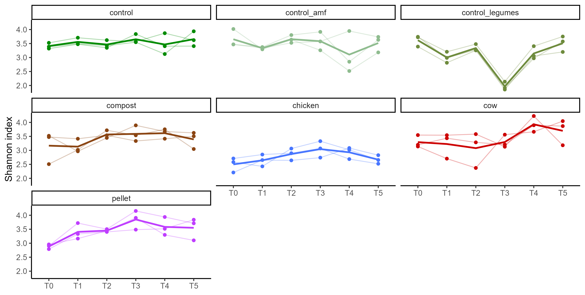
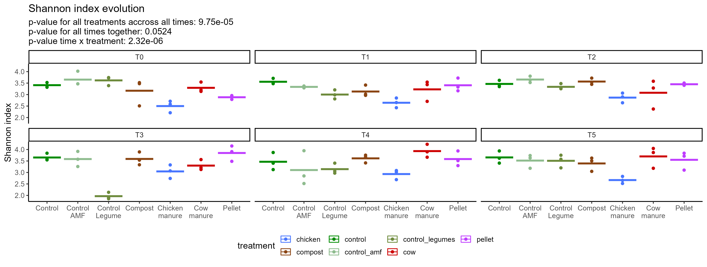
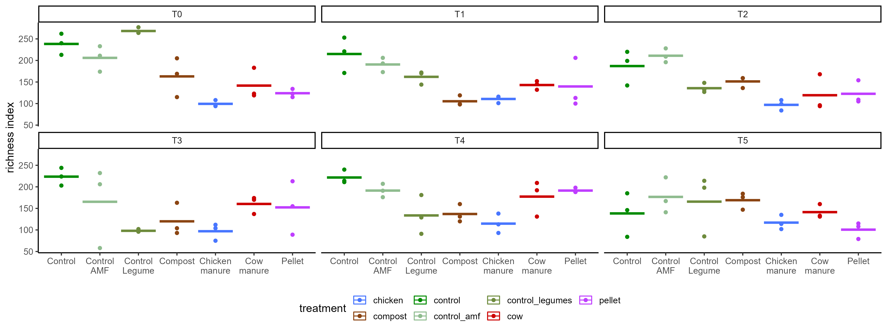

```{r setup, include=FALSE}
knitr::opts_chunk$set(include = FALSE)
```

## Libraries

```{r libraries, include=FALSE}
library(readxl)
library(agricolae)
library(tidyr)
library(tidyverse)
library(ggpubr)
library(rstatix)
library(MASS)
library(dplyr)
library(dunn.test)
library(corrplot)
library(gridExtra)
library(phyloseq)
library(vegan)
library(here)
library(geomtextpath)
library(nlme)
library(ggpmisc)
library(knitr)
library(kableExtra)
library(car)
library(lmerTest)
library(emmeans)
library(multcomp)
library(FactoMineR)
library(factoextra)
library(ALDEx2)
library(ggrepel)
library(ggforce)
library(scales)
reverselog_trans <- function(base = exp(1)) {
    trans <- function(x) -log(x, base)
    inv <- function(x) base^(-x)
    trans_new(paste0("reverselog-", format(base)), trans, inv, 
              log_breaks(base = base), 
              domain = c(1e-100, Inf))
}#create function for inversed log10 axis

```


```{r colors and order, include=FALSE}
treat.colors <- c("control"= "green4" ,"control_amf"  = "darkseagreen" , "chicken"= "royalblue1", "cow" = "red3","pellet"= "darkorchid1","compost"="chocolate4","control_legumes"="darkolivegreen4")
time.colors <- c("T0"="#66c2a5", "T1"="#fc8d62", "T2"="#8da0cb", "T3"="#e78ac3", "T4"="#a6d854", "T5"="#ffd92f")
time.colors <- c("T0"="#BFD3E6", "T1"="#9ECAE1", "T2"="#6BAED6", "T3"="#4292C6", "T4"="#2171B5", "T5"="#08519C")
 time.colors <- c("#BFD3E6", "#9ECAE1", "#6BAED6", "#4292C6", "#2171B5", "#08519C")

treat.order <- c('control', 'control_amf', 'control_legumes', "compost", "chicken", "cow", "pellet") 
treat.labels <- c("Control", "Control\nAMF", "Control\nLegume", "Compost", "Chicken\nmanure", "Cow\nmanure", "Pellet")
```

```{r import data}
import <- here("ITS_banana", "p1031_run231023_ITS_ccs_ZOTU_c97_Count_Sintax.txt")
zotu97 <- import_qiime(otufilename= import)
metadata <- read_delim(file= here("ITS_banana","metadata.csv" ),show_col_types = FALSE) %>% 
  column_to_rownames(var= "sample_name")

zotu97 <- merge_phyloseq(zotu97, sample_data(metadata))
```

```{r phylum with NA}
kingdom_list <- tax_table(zotu97) %>% as.data.frame() %>% pull(Kingdom)
phylum_list <- tax_table(zotu97) %>% as.data.frame() %>% pull(Phylum) %>% na.omit() %>% unique()

#Get all the otus with unknown phylum
unknown_seqs <- tax_table(zotu97) %>% as.data.frame()
unknown_seqs <-unknown_seqs[is.na(unknown_seqs$Phylum),]
nrow(unknown_seqs)
nrow(tax_table(zotu97))
unknown_OTUs <- row.names(unknown_seqs) %>% as.vector()

numFungi <- kingdom_list[kingdom_list== "Fungi"] %>% length()
notFungi <- kingdom_list[!kingdom_list== "Fungi"] %>% length()

num_unknown <- unknown_seqs %>% dplyr::count() %>% as.vector() 
```

The dataset contains `r numFungi` sequences that belong to the Fungi Kingdom and `r notFungi` sequences that are not Fungi but Rhizaria (Phylum Cercozoa)


```{r Phyla with NA , echo=FALSE}

dat_merge_all_tax <- tax_glom(physeq = zotu97, "Phylum", NArm = FALSE)
molten_dat_all_merge <- psmelt(dat_merge_all_tax)
p_phyla_NA <- ggplot(molten_dat_all_merge, 
                  aes(x=Kingdom, y = Abundance/sum(Abundance)*100,fill=Phylum)) + 
  geom_col() +
  xlab("") + 
  ylab("Relative abundance (% of total sequences)") +
   theme_minimal() +
  ggtitle("Phyla representation in the total of sequences")+
  #theme(axis.text.x=element_blank(), axis.title.x=element_blank())+
  theme(legend.position="bottom")
p_phyla_NA
ggsave(p_phyla_NA, file= "ITS_results/phyla_NA.png")
```

```{r, Phyla without NA, echo= FALSE}
dat_merge_all_tax <- tax_glom(physeq = zotu97, "Phylum", NArm = TRUE)
molten_dat_all_merge <- psmelt(dat_merge_all_tax)
p_phyla <- ggplot(molten_dat_all_merge, 
                  aes(x = Kingdom,y = Abundance/sum(Abundance)*100,fill=Phylum)) + 
  geom_col() +
  xlab("Kingdom") + 
  ylab("Relative abundance (% of total sequences)") +
   theme_minimal() +
  ggtitle("Phyla representation in the total of sequences (Unassigned sequences removed)")+
  #theme(axis.text.x=element_blank(), axis.title.x=element_blank())+
  theme(legend.position="bottom")
p_phyla
ggsave(p_phyla, file= "ITS_results/phyla.png")
```





```{r Sequencing depth z97 , include=FALSE}

seqdepth97 <- colSums(otu_table(zotu97)) #get the number of sequences(or reads) per sample
sample.table97 <- sample_data(zotu97)
sample.table97 <- cbind(seq.depth= seqdepth97, sample.table97) #binds the number of sequences per sample to the sample data that also contains the metadata. This allows to filter all the data according to experiment, repetition, treatment...


```

```{r plot Sequences per sample z97, echo=FALSE, message=FALSE, warning=FALSE}
summary(aov(seq.depth~treatment, data = sample.table97))
summary(aov(seq.depth~time, data = sample.table97))

plot.seq.depth.treat <- sample.table97 %>% 
 ggplot(aes(x = factor(treatment, level= treat.order), y = seq.depth, col= treatment)) +
  geom_boxplot()+
  theme(legend.position="bottom")+
  labs(y= "N.sequences", x= "Treatment", title = "Sequencing depth of the different treatments and soils")+
  scale_color_manual(values= treat.colors)+
  scale_x_discrete(labels= treat.labels)+
  theme_classic2()
plot.seq.depth.treat

plot.seq.depth.time <- sample.table97 %>% 
 ggplot(aes(x = time, y = seq.depth, col= time)) +
  geom_boxplot(outlier.colour = NA)+
  theme(legend.position="bottom")+
  scale_color_manual(values= time.colors)+
  labs(y= "N.sequences", x= "Time", title = "Sequencing depth of the different treatments and soils")+
  theme_classic2()
plot.seq.depth.time
```

As seen in the graphs above, there is uneven sequencing depth among treatments (Wilcoxon test on the means of the sequencing depth of the treatments), this might lead to differences in the representation of the samples. This can also be visualized with the use of rarefaction plots. 

### Rarefaction plots {.tabset}

```{r  Rarefaction zOTU97, include=FALSE}
trans_zotu97 <- t(otu_table(zotu97)) %>% data.frame() #transpose the otu table
rarecurve97 <- rarecurve(trans_zotu97, step=1000, xlab= "number of sequences", ylab="number of OTUs", label = FALSE, col= 2)
plot_rare <- rarecurve97 %>% 
  purrr::map(~ tibble(
    y = as.vector(.x),
    x = unname(attr(.x, "Subsample")),
    steps = names(.x))) %>%
  tibble(data = ., sample = seq_along(.)) %>%
  unnest(data)

stopifnot(identical(sort(unique(plot_rare$sample)), 1:NROW(sample.table97))) #plot_data$sample and sample_data(zotu97) must be identical
sample.table97 <- sample.table97[sample.table97$treatment != "NTC", ] %>% .[.$treatment != "CTL", ]
zotu97 <- subset_samples(zotu97, treatment != "NTC" & treatment != "CTL")
plot_rare$treat <- (sample.table97$treatment)[plot_rare$sample]
plot_rare$time <- (sample.table97$time)[plot_rare$sample]

pp_treat <- plot_rare %>% 
  ggplot() +
  geom_line(aes(x,y, color = treat, group = sample),lwd= 1) +
   theme(legend.position = "bottom",plot.title = element_text(hjust = 0.5))+
  ylab("Number of OTUs")+
  xlab("Number of sequences") +
  ggtitle("Rarefaction curve by treatment")+
  geom_textvline(xintercept = min(sample.table97$seq.depth), label = paste(min(sample.table97$seq.depth), "= min seq depth"))+
  coord_cartesian(xlim = c(0, 60000), ylim = c(0, 450))+scale_color_manual(values= treat.colors)
pp_treat
ggsave(pp_treat, file= "ITS_results/rare_treat.png")

pp_time <- plot_rare %>% 
  ggplot() +
  geom_line(aes(x,y, color = time, group = sample),lwd= 1) +
   theme(legend.position = "bottom",plot.title = element_text(hjust = 0.5))+
  ylab("Number of OTUs")+
  xlab("Number of sequences") +
  ggtitle("Rarefaction curve by time")+
  geom_textvline(xintercept = min(sample.table97$seq.depth), label = paste(min(sample.table97$seq.depth), "= min seq depth"))+
  coord_cartesian(xlim = c(0, 60000), ylim = c(0, 450))+scale_color_manual(values= time.colors)
pp_time
ggsave(pp_time, file= "ITS_results/rare_time.png")


rarefaction_curves <- grid.arrange(pp_treat, pp_time, nrow=2)
```

#### Rarefaction plot by treatment



#### Rarefaction plot by soil




## Rarefy the data

A way to fight the differences in the sequencing depth is rarefying the data. This statistical process randomly samples the same number of sequences, obtaining a higher fidelity of representation of the taxa composition of each sample. It is performed in loop for a high number of times (500, for example) so that the random choice of taxa is warrantied.

The following code chunk performs rarefaction 500 times, then it calculates the Shannon index (as the negative sum of all the frequencies times the logarithm of the frequencies), the richness and the evenness with the average abundances resulting of those 500 iterations. To avoid wasting time, the results are saved to an object and loaded in a separate chunk.

```{r 500 rarefaction loop, eval=FALSE, include=FALSE}
#My own shannon function
shannon.iro <- function(x){
 fi <- x[x>0]/sum(x) #frequency of species "i" is equal to count (if > 0) divided by the sum of all counts
  -sum(fi*log(fi)) #shannon index is the negative of the sum of all the frequencies of all the species times the log of those species
}
#create empty vectors
richness_500 <- c()
diversity_500 <- c()
even_500 <- c()
for (i in 1:500){
 #generate rarefied community
 temp_500 <-  rarefy_even_depth(otu_table(zotu97), rngseed = 22081998, sample.size = min(sample.table97$seq.depth))
#  richness is species number
 s <- specnumber(temp_500, MARGIN=2)
richness_500 <- cbind(richness_500,s)
  
  #diverasity uses my own formula
shannon<- apply(temp_500,2, shannon.iro)
diversity_500 <- cbind(diversity_500,shannon)
 #evenness
j <- shannon/s
 even_500 <- cbind(even_500,j)
} 

#calculate means of subsamples
shannon <- rowMeans(diversity_500)
richness <- rowMeans(richness_500)
evenness <- rowMeans(even_500)

# put them all in one dataframe
summary_diversity_rar <- data.frame( cbind( shannon, richness, evenness))
stopifnot(identical(rownames(sample_data(zotu97)), names(richness)))

sample.table97.500<- cbind(summary_diversity_rar, sample_data(zotu97))
save(sample.table97.500, file=here("ITS_banana", "sample.table97.500.Rdata"))
#save the results of the loop in an object to avoid wasting time in each run, if needed to re-run, change the chunk option to "eval= TRUE"
```


```{r Load the rarefying loop, include = FALSE}
load(here("ITS_banana",  "sample.table97.500.Rdata"))

#merge this rarefied data with a phyloseq object
zotu97.rar <- merge_phyloseq(zotu97, sample_data(sample.table97.500))
# zotu97.rar contains the samples, the experimental variables and the alpha diversity indexes resulting of the rarefying loop.
```

```{r, include= TRUE}
zotu97
zotu97.rar
```


## Alpha diversity {.tabset}


```{r}
data <- sample_data(zotu97.rar)
#Create binding variable for treatment and repetition (unique identifier (might not be necessary))
treat.pot <- paste(data$treatment, data$rep, sep= "_")
data <- data.frame(data, treat.pot)

data %>% 
  group_by(time) %>%
  shapiro_test(shannon)
ggqqplot(data=data, "shannon", facet.by= "time")

data %>% 
  group_by(treatment) %>%
  shapiro_test(shannon)
ggqqplot(data=data, "shannon", facet.by= "treatment")

data %>% 
  group_by(time) %>%
  shapiro_test(evenness)
ggqqplot(data=data, "evenness", facet.by= "time")

data %>% 
  group_by(treatment) %>%
  shapiro_test(evenness)
ggqqplot(data=data, "evenness", facet.by= "treatment")

data %>% 
  group_by(time) %>%
  shapiro_test(richness)
ggqqplot(data=data, "richness", facet.by= "time")

data %>% 
  group_by(treatment) %>%
  shapiro_test(richness)
ggqqplot(data=data, "richness", facet.by= "treatment")


# Overall the data behaves as a normall distribution. 
```


### Statistical analysis

```{r stats for all time points}
#########SHANNON###############
lmer.shannon <- lmer(shannon ~ time*treatment+(1|treat.pot) , data = data)
#Repeated measures anova
anova.shannon <- anova(lmer.shannon) %>% as.data.frame()
#extract pvalue and other stats
pval.shannon <- anova.shannon %>% rownames_to_column(var= "Variable")
#adjust the format
pval.shannon <- pval.shannon %>% rename_at('Pr(>F)', ~'p.value')
pval.shannon <- pval.shannon %>% rename_at('F value', ~'F.value')
pval.shannon <- pval.shannon %>% rename_at('NumDF', ~'df')
pval.shannon$p.value <- format.pval(pval.shannon$p.value, digits = 3)
pval.shannon$F.value <- round(pval.shannon$F.value,2)
pval.shannon$`Sum Sq` <- NULL
pval.shannon$`Mean Sq` <- NULL
pval.shannon$`DenDF` <- NULL
pval.shannon
time.pval.shannon <- pval.shannon$p.value[1]
treat.pval.shannon <- pval.shannon$p.value[2]
int.pval.shannon <- pval.shannon$p.value[3]

emmeans.shannon.treatment <- cld(emmeans(lmer.shannon, ~treatment), Letters = letters, reversed= TRUE) %>%
  data.frame %>% rename_at(".group", ~"group")


########## RICHNESS###############
lmer.richness <- lmer(richness ~ time*treatment+(1|treat.pot) , data = data)
#Repeated measures anova
anova.richness <- anova(lmer.richness) %>% as.data.frame()
#extract pvalue and other stats
pval.richness <- anova.richness %>% rownames_to_column(var= "Variable")
#adjust the format
pval.richness <- pval.richness %>% rename_at('Pr(>F)', ~'p.value')
pval.richness <- pval.richness %>% rename_at('F value', ~'F.value')
pval.richness <- pval.richness %>% rename_at('NumDF', ~'df')
pval.richness$p.value <- format.pval(pval.richness$p.value, digits = 3)
pval.richness$F.value <- round(pval.richness$F.value,2)
pval.richness$`Sum Sq` <- NULL
pval.richness$`Mean Sq` <- NULL
pval.richness$`DenDF` <- NULL
pval.richness
time.pval.richness <- pval.richness$p.value[1]
treat.pval.richness <- pval.richness$p.value[2]
int.pval.richness <- pval.richness$p.value[3]

emmeans.richness.treatment <- cld(emmeans(lmer.richness, ~treatment), Letters = letters, reversed= TRUE) %>%
  data.frame %>% rename_at(".group", ~"group")

#########EVENNESS###########
lmer.evenness <- lmer(evenness ~ time*treatment+(1|treat.pot) , data = data)
#Repeated measures anova
anova.evenness <- anova(lmer.evenness) %>% as.data.frame()
#extract pvalue and other stats
pval.evenness <- anova.evenness %>% rownames_to_column(var= "Variable")
#adjust the format
pval.evenness <- pval.evenness %>% rename_at('Pr(>F)', ~'p.value')
pval.evenness <- pval.evenness %>% rename_at('F value', ~'F.value')
pval.evenness <- pval.evenness %>% rename_at('NumDF', ~'df')
pval.evenness$p.value <- format.pval(pval.evenness$p.value, digits = 3)
pval.evenness$F.value <- round(pval.evenness$F.value,2)
pval.evenness$`Sum Sq` <- NULL
pval.evenness$`Mean Sq` <- NULL
pval.evenness$`DenDF` <- NULL
pval.evenness
time.pval.evenness <- pval.evenness$p.value[1]
treat.pval.evenness <- pval.evenness$p.value[2]
int.pval.evenness <- pval.evenness$p.value[3]

emmeans.evenness.treatment <- cld(emmeans(lmer.evenness, ~treatment), Letters = letters, reversed= TRUE) %>%
  data.frame %>% rename_at(".group", ~"group")

```

```{r stats for delta T}
#Creation of the data set

data.t0 <- subset(data, data$time == "T0")
data.t5 <- subset(data, data$time == "T5")
data.delta <- data.frame("treatment"=data.t0$treatment,
                         "rep"= data.t0$rep, 
                         "sample_ID" = data.t0$sample_ID, 
                         "treat.pot"= data.t0$treat.pot, 
                         "d.shannon" =data.t5$shannon - data.t0$shannon,
                         "d.rich" =data.t5$richness - data.t0$richness,
                         "d.even" =data.t5$evenness - data.t0$evenness)
#########SHANNON###############
lm.d.shannon <- lm(d.shannon ~ 0+treatment, data = data.delta)
d.pval.shannon <- summary(lm.d.shannon)$coefficient %>% 
  as.data.frame() %>%
  rownames_to_column(var= "treatment")
d.pval.shannon$treatment <- sub("treatment", "", d.pval.shannon$treatment)
d.pval.shannon$sign <- ifelse(d.pval.shannon$`Pr(>|t|)`<0.05, "*", "ns")


#########rich###############
lm.d.rich <- lm(d.rich ~ 0+treatment, data = data.delta)
d.pval.rich <- summary(lm.d.rich)$coefficient  %>%
  as.data.frame() %>% 
  rownames_to_column(var= "treatment")
d.pval.rich$treatment <- sub("treatment", "", d.pval.rich$treatment)
d.pval.rich$sign <- ifelse(d.pval.rich$`Pr(>|t|)`<0.05, "*", "ns")

#########even###############
lm.d.even <- lm(d.even ~ 0+treatment, data = data.delta)
d.pval.even <- summary(lm.d.even)$coefficient%>%
  as.data.frame()%>%
  rownames_to_column(var= "treatment")
d.pval.even$treatment <- sub("treatment", "", d.pval.even$treatment)
d.pval.even$sign <- ifelse(d.pval.even$`Pr(>|t|)`<0.05, "*", "ns")

```

### Shannon

```{r shannon}
shannon_time_facet <- data %>% ggplot(aes(x= factor(treatment, level= treat.order), y= shannon, color= treatment)) +
  geom_point()+
  scale_color_manual(values= treat.colors)+
  facet_wrap(~time)+
  theme_classic2()+
  stat_summary(aes(x= treatment, y = shannon, group = treatment, col= treatment),fun= mean, geom = "crossbar")+
  scale_x_discrete(labels= treat.labels)+
  xlab(NULL)+ylab("Shannon index")+
  theme(legend.position = "bottom")+
  ggtitle("Shannon index evolution", subtitle = paste("p-value for all treatments accross all times:", treat.pval.shannon, "\np-value for all times together:", time.pval.shannon, "\np-value time x treatment:", int.pval.shannon))
shannon_time_facet
ggsave(shannon_time_facet, file= "ITS_results/shannon_time_facet.png", width = 4000, unit= "px")

shannon_treat_facet <- data %>% ggplot(aes(x= time, y= shannon, color= treatment, group = treat.pot)) +
  geom_point()+
  scale_color_manual(values= treat.colors)+
  geom_line(aes(col=treatment), alpha= 0.3)+
  stat_summary(aes(x= time, y = shannon, group = treatment, col= treatment),fun= mean, geom = "smooth", linetype= 1)+
  facet_wrap(~factor(treatment, level= treat.order))+
  xlab(NULL)+ylab("Shannon index")+
  theme_classic2()+guides(color= "none")
shannon_treat_facet
ggsave(shannon_treat_facet, file= "ITS_results/shannon_treat_facet.png", width = 3000, unit= "px")


shannon.plots <- grid.arrange(shannon_treat_facet, shannon_time_facet,ncol=1)
ggsave(shannon.plots, file="ITS_results/shannon_all_facet.png", width=4000, height= 4000, units = "px")
```






```{r}
d.pval.shannon$size <- ifelse(d.pval.shannon$sign== "*", 8, 4)
d.pval.shannon$size <- as.numeric(d.pval.shannon$size)
d.shannon.plot <- data.delta %>% ggplot(aes( factor(treatment, level= treat.order), d.shannon))+
  geom_point(shape= 23, size = 4, col= "black", aes(fill= treatment))+
  geom_hline(yintercept = 0, linetype= 2 )+
  geom_text(data= d.pval.shannon,aes(treatment, -0.7, label = sign),
            size=d.pval.shannon$size)+
  ylab("\u0394Shannon index (T5-T0)")+
  xlab("Treatment")+
  scale_fill_manual(values= treat.colors)+
  scale_color_manual(values= treat.colors)+
  scale_x_discrete(label= treat.labels)+
  stat_summary(aes(x= treatment, y = d.shannon, group = treatment, col= treatment),fun= mean, geom = "crossbar", linewidth= 0.5, show.legend = FALSE)+
  theme_classic2()+
  ggtitle("Variation in Shannon index")+
  guides(fill=guide_legend(title="Treatment"))
d.shannon.plot
ggsave(d.shannon.plot, file= "ITS_results/delta/delta_shannon.png", unit= "px", width= 1900, height= 1200)
```


### Evenness

```{r evenness}

#Repeated measures anova
anova.evenness <- summary(aov(evenness ~ time*treatment+ Error(rep), data = data))
#extract pvalue and other stats
pval.evenness <- anova.evenness[[2]][[1]] %>% data.frame() %>% rownames_to_column(var= "Variable")
#adjust the format
pval.evenness <- pval.evenness %>% rename_at('Pr..F.', ~'p.value')
pval.evenness$p.value <- format.pval(pval.evenness$p.value, digits = 3)
pval.evenness$F.value <- round(pval.evenness$F.value,2)
pval.evenness$Sum.Sq <- NULL
pval.evenness$Mean.Sq <- NULL
pval.evenness
#convert into kable
#pval.evenness <- kableExtra::kable_styling(kable(pval.evenness, caption= "Repeated measures ANOVA", align = "c"),full_width = F)


evenness_time_facet <- data %>% ggplot(aes(x= factor(treatment, level= treat.order), y= evenness, color= treatment)) +
  geom_point()+
  scale_color_manual(values= treat.colors)+
  facet_wrap(~time)+
  theme_classic2()+
  stat_summary(aes(x= treatment, y = evenness, group = treatment, col= treatment),fun= mean, geom = "crossbar")+
  scale_x_discrete(labels= treat.labels)+
  xlab(NULL)+ylab("evenness index")+
  theme(legend.position = "bottom")
evenness_time_facet
ggsave(evenness_time_facet, file= "ITS_results/evenness_time_facet.png", width = 4000, unit= "px")

evenness_treat_facet <- data %>% ggplot(aes(x= time, y= evenness, color= treatment, group = treat.pot)) +
  geom_point()+
  scale_color_manual(values= treat.colors)+
  geom_line(aes(col=treatment), alpha= 0.3)+
  stat_summary(aes(x= time, y = evenness, group = treatment, col= treatment),fun= mean, geom = "smooth", linetype= 1)+
  facet_wrap(~factor(treatment, level= treat.order))+
  xlab(NULL)+ylab("evenness index")+
  theme_classic2()+guides(color= "none")
evenness_treat_facet
ggsave(evenness_treat_facet, file= "ITS_results/evenness_treat_facet.png", width = 3000, unit= "px")

#Create an empty plot (theme_void()) to plot the table using geom_table() and add it to the multiplot in grid.arrange()
df <- tibble(x = 0, y = 0, tb = list(pval.evenness))

stat.table <- ggplot()+
  geom_table(data=df, aes(x=x, y=y, label= tb),size= 10, table.theme = ttheme_gtsimple(size= 10))+
  theme_void()
stat.table

evenness.plots <- grid.arrange(evenness_treat_facet, evenness_time_facet,stat.table,layout_matrix = rbind(c(1,1,1),c(1,1,1),c(1,3,3), c(2,2,2),c(2,2,2)))
ggsave(evenness.plots, file="ITS_results/evenness_all_facet.png", width=4000, height= 4000, units = "px")
```


```{r}
d.pval.even$size <- ifelse(d.pval.even$sign== "*", 8, 4)
d.pval.even$size <- as.numeric(d.pval.even$size)
d.even.plot <- data.delta %>% ggplot(aes( factor(treatment, level= treat.order), d.even))+
  geom_point(shape= 23, size = 4, col= "black", aes(fill= treatment))+
  geom_hline(yintercept = 0, linetype= 2 )+
  geom_text(data= d.pval.even,aes(treatment, 0.02, label = sign),
            size=d.pval.even$size)+
  ylab("\u0394evenness (T5-T0)")+
  xlab("Treatment")+
  scale_fill_manual(values= treat.colors)+
  scale_color_manual(values= treat.colors)+
  scale_x_discrete(label= treat.labels)+
  stat_summary(aes(x= treatment, y = d.even, group = treatment, col= treatment),fun= mean, geom = "crossbar", linewidth= 0.5, show.legend = FALSE)+
  theme_classic2()+
  ggtitle("Variation in evenness")+
  guides(fill=guide_legend(title="Treatment"))
d.even.plot
ggsave(d.even.plot, file= "ITS_results/delta/delta_even.png", unit= "px", width= 1900, height= 1200)
```
### Richnness

```{r richness}

#Repeated measures anova
anova.richness <- summary(aov(richness ~ time*treatment+ Error(rep), data = data))
#extract pvalue and other stats
pval.richness <- anova.richness[[2]][[1]] %>% data.frame() %>% rownames_to_column(var= "Variable")
#adjust the format
pval.richness <- pval.richness %>% rename_at('Pr..F.', ~'p.value')
pval.richness$p.value <- format.pval(pval.richness$p.value, digits = 3)
pval.richness$F.value <- round(pval.richness$F.value,2)
pval.richness$Sum.Sq <- NULL
pval.richness$Mean.Sq <- NULL
pval.richness
#convert into kable
#pval.richness <- kableExtra::kable_styling(kable(pval.richness, caption= "Repeated measures ANOVA", align = "c"),full_width = F)


richness_time_facet <- data %>% ggplot(aes(x= factor(treatment, level= treat.order), y= richness, color= treatment)) +
  geom_point()+
  scale_color_manual(values= treat.colors)+
  facet_wrap(~time)+
  theme_classic2()+
  stat_summary(aes(x= treatment, y = richness, group = treatment, col= treatment),fun= mean, geom = "crossbar")+
  scale_x_discrete(labels= treat.labels)+
  xlab(NULL)+ylab("richness index")+
  theme(legend.position = "bottom")
richness_time_facet
ggsave(richness_time_facet, file= "ITS_results/richness_time_facet.png", width = 4000, unit= "px")

richness_treat_facet <- data %>% ggplot(aes(x= time, y= richness, color= treatment, group = treat.pot)) +
  geom_point()+
  scale_color_manual(values= treat.colors)+
  geom_line(aes(col=treatment), alpha= 0.3)+
  stat_summary(aes(x= time, y = richness, group = treatment, col= treatment),fun= mean, geom = "smooth", linetype= 1)+
  facet_wrap(~factor(treatment, level= treat.order))+
  xlab(NULL)+ylab("richness index")+
  theme_classic2()+guides(color= "none")
richness_treat_facet
ggsave(richness_treat_facet, file= "ITS_results/richness_treat_facet.png", width = 3000, unit= "px")

#Create an empty plot (theme_void()) to plot the table using geom_table() and add it to the multiplot in grid.arrange()
df <- tibble(x = 0, y = 0, tb = list(pval.richness))

stat.table <- ggplot()+
  geom_table(data=df, aes(x=x, y=y, label= tb),size= 10, table.theme = ttheme_gtsimple(size= 10))+
  theme_void()
stat.table

richness.plots <- grid.arrange(richness_treat_facet, richness_time_facet,stat.table,layout_matrix = rbind(c(1,1,1),c(1,1,1),c(1,3,3), c(2,2,2),c(2,2,2)))
ggsave(richness.plots, file="ITS_results/richness_all_facet.png", width=4000, height= 4000, units = "px")
```





```{r}
d.pval.rich$size <- ifelse(d.pval.rich$sign== "*", 8, 4)
d.pval.rich$size <- as.numeric(d.pval.rich$size)
d.rich.plot <- data.delta %>% ggplot(aes( factor(treatment, level= treat.order), d.rich))+
  geom_point(shape= 23, size = 4, col= "black", aes(fill= treatment))+
  geom_hline(yintercept = 0, linetype= 2 )+
  geom_text(data= d.pval.rich,aes(treatment,-150, label = sign),
            size=d.pval.rich$size)+
  ylab("\u0394richness (T5-T0)")+
  xlab("Treatment")+
  scale_fill_manual(values= treat.colors)+
  scale_color_manual(values= treat.colors)+
  scale_x_discrete(label= treat.labels)+
  stat_summary(aes(x= treatment, y = d.rich, group = treatment, col= treatment),fun= mean, geom = "crossbar", linewidth= 0.5, show.legend = FALSE)+
  theme_classic2()+
  ggtitle("Variation in richness")+
  guides(fill=guide_legend(title="Treatment"))
d.rich.plot
ggsave(d.rich.plot, file= "ITS_results/delta/delta_rich.png", unit= "px", width= 1900, height= 1200)
```


# Beta diversity (CLR PCA) {.tabset}

## T5 vs T0

```{r, include=TRUE}
zotu.rel<-  transform_sample_counts(zotu97, function(x) x / sum(x))
#SUBSET BY TIME
zotu.rel.t0<- subset_samples(zotu.rel, time== "T0")
zotu.rel.t5<- subset_samples(zotu.rel, time== "T5")
zotu.rel.t0.t5 <- subset_samples(zotu.rel, time =="T0" | time =="T5")
data.t0.t5 <- sample_data(zotu.rel.t0.t5) %>% data.frame()
data.t0.t5$treat.pot <- paste(data.t0.t5$treatment, data.t0.t5$rep, sep= "_")

##### T0 + T5
t.otu <- zotu.rel.t0.t5 %>% otu_table() %>% data.frame() %>% t()
t.otu.clr <- decostand(t.otu, method = "clr", pseudocount = 1)
pca.clr <- prcomp(t.otu.clr, scale=TRUE)
scores <- data.frame(pca.clr$x)
t0.t5.pca <- data.frame(scores, sample_data(zotu.rel.t0.t5))
variance_perc <- pca.clr$sdev^2 / sum(pca.clr$sdev^2) * 100 

#PERMANOVA 

### Set the type of permutations to account for random error of repeated measures
library("permute")
h <- how(plots = Plots(strata = data.t0.t5$treat.pot, type = "none"), nperm = 999)


eu.distances <- vegdist(scores, method= "euclidean")


eu.permanova <- adonis2(eu.distances ~ time*treatment+rep, data = data.t0.t5, permutations = h) %>% data.frame()


perm.time <- paste("Time:                        Treatment:                        Time x Treatment:\n", 
                   "R2=", round(eu.permanova["time", "R2"], 2),"                 R2=",round(eu.permanova["treatment", "R2"], 2), "                         R2=",round(eu.permanova["time:treatment", "R2"], 2),"\n",
                   "F=", round(eu.permanova["time", "F"], 2),"                    F=",round(eu.permanova["treatment", "F"], 2), "                           F=",round(eu.permanova["time:treatment", "F"], 2),"\n",
                   "p-value=", eu.permanova["time", "Pr..F."],"         p-value=",eu.permanova["treatment", "Pr..F."], "                 p-value=",eu.permanova["time:treatment", "Pr..F."])


#PLOT

pca.plot.t0.t5.time <- ggplot(t0.t5.pca, aes(PC1, PC2, col= treatment, shape= time))+
  geom_point(size= 3)+
  scale_color_manual(values= treat.colors)+
  scale_shape_manual(values=c(17,16))+
  labs(x= sprintf("PC1 (%.1f%%)", variance_perc[1]), 
       y= sprintf("PC2 (%.1f%%)", variance_perc[2]))+
  ggtitle("Community composition at T0 and T5 CLR transformed", subtitle= perm.time)+
  stat_ellipse(aes(group =time, fill= treatment), level = 0.95,geom= "polygon", alpha = 0.3, show.legend = TRUE)+
  scale_fill_manual(values= c("gold", "gray50"))+
  geom_polygon(aes(group= interaction(time, treatment),col= treatment), alpha= 0, show.legend = FALSE)+
  theme_classic2()
pca.plot.t0.t5.time
```

## T0 

```{r, include=TRUE}
#PCA
t.otu <- zotu.rel.t0 %>% otu_table() %>% data.frame() %>% t()
t.otu.clr <- decostand(t.otu, method = "clr", pseudocount = 1)
pca.clr <- prcomp(t.otu.clr, scale=TRUE)
scores <- data.frame(pca.clr$x)
t0.pca <- data.frame(scores, sample_data(zotu.rel.t0))
variance_perc <- pca.clr$sdev^2 / sum(pca.clr$sdev^2) * 100 

#PERMANOVA
eu.distances <- vegdist(scores, method = "euclidean")
eu.permanova <- adonis2(eu.distances ~ treatment, data = data.frame(sample_data(zotu.rel.t0)), parallel=3, na.action=na.omit)
eu.permanova <- eu.permanova %>% as.data.frame()

perm.t0 <- paste( "PERMANOVA treatment: \n", 
                  "R2=",round(eu.permanova["treatment", "R2"],2),";",
                  "F=", round(eu.permanova["treatment", "F"],2),";",
                  "p-value=",eu.permanova["treatment", "Pr(>F)"])

#PLOT
pca.plot.t0 <- ggplot(t0.pca, aes(PC1, PC2, col= treatment))+
  geom_point(size= 3, shape= 0)+
  scale_color_manual(values= treat.colors)+
  labs(x= sprintf("PC1 (%.1f%%)", variance_perc[1]), 
       y= sprintf("PC2 (%.1f%%)", variance_perc[2]))+
  geom_polygon(aes(fill =  treatment, group = interaction(time, treatment)),alpha= 0.5, show.legend = FALSE)+
  scale_fill_manual(values= treat.colors)+
  ggtitle("CLR transformed abundances at T0", subtitle = perm.t0)+
  theme_classic2()
pca.plot.t0
```

## T5

```{r, include=TRUE}
#PCA
t.otu <- zotu.rel.t5 %>% otu_table() %>% data.frame() %>% t()
t.otu.clr <- decostand(t.otu, method = "clr", pseudocount = 1)
pca.clr <- prcomp(t.otu.clr, scale=TRUE)
scores <- data.frame(pca.clr$x)
t5.pca <- data.frame(scores, sample_data(zotu.rel.t5))
variance_perc <- pca.clr$sdev^2 / sum(pca.clr$sdev^2) * 100 
#PERMANOVA
eu.distances <- vegdist(scores, method = "euclidean")
eu.permanova <- adonis2(eu.distances ~ treatment, data = data.frame(sample_data(zotu.rel.t5)), parallel=3, na.action=na.omit)
eu.permanova <- eu.permanova %>% as.data.frame()
#PLOT
perm.t5 <- paste( "PERMANOVA treatment: \n", 
                  "R2=",round(eu.permanova["treatment", "R2"],2),";",
                  "F=", round(eu.permanova["treatment", "F"],2),";",
                  "p-value=",eu.permanova["treatment", "Pr(>F)"])

pca.plot.t5 <- ggplot(t5.pca, aes(PC1, PC2, col= treatment))+
  geom_point(size= 3, shape= 16)+
  scale_color_manual(values= treat.colors)+
  labs(x= sprintf("PC1 (%.1f%%)", variance_perc[1]), 
       y= sprintf("PC2 (%.1f%%)", variance_perc[2]))+
  geom_polygon(aes(fill =  treatment, group = interaction(time, treatment)),alpha= 0.5, show.legend = FALSE)+
  scale_fill_manual(values= treat.colors)+
  ggtitle("CLR transformed abundances at T5", subtitle = perm.t5)+
  theme_classic2()
pca.plot.t5

```

## PERMANOVA

```{r}
eu.distances <- vegdist(scores, method = "euclidean")

eu.permanova <- adonis2(eu.distances ~ time*treatment, data = data.frame(sample_data(zotu.rel.t0.t5)), parallel=3, na.action=na.omit)
eu.permanova <- eu.permanova %>% as.data.frame()  
permanova.response <- adonis2(eu.distances~ RRI, data= sample.data.pca, parallel = 3, na.action=na.omit)

```

```{r preparations for aldex}
ald.zotu <- subset_samples(zotu97, time =="T0" | time =="T5")

ald.zotu<- prune_taxa(taxa_sums(ald.zotu) > 1, ald.zotu)
#Remove singletons and zotus with less than 4 sequences in 4 samples 
cleaning.function <- function(x) { x >  4}
keep_taxa <- genefilter_sample(ald.zotu, cleaning.function, A = 4)
ald.zotu<- prune_taxa(keep_taxa, ald.zotu)
otu.table <- ald.zotu%>% otu_table() %>% data.frame()

#create vectors that contain the variables to guide the aldex.clr() "conds" argument
time.vector <- sample_data(ald.zotu)$time
treat.vector <- sample_data(ald.zotu)$treatment
rep.vector <- sample_data(ald.zotu)$rep
```


## DAA

```{r}
estimates.treat <- aldex.clr(otu.table, denom= "all", conds= treat.vector,mc.samples = 128)
ald.kw.treat <- aldex.kw(estimates.treat)
p.val.aldex.treat <- subset(ald.kw.treat, ald.kw.treat$glm.eBH < 0.05)

ald.clr <- aldex.clr(otu.table, denom= "all")
clr.abu <- ald.clr@reads#get the clr transformed abundance  data and divide it in times t0 and t5
clr.abu.t0 <- clr.abu[,1:21]
clr.abu.t5 <- clr.abu[,22:42]
log2fc <- log2(clr.abu.t0/clr.abu.t5)
log2fc$log2 <- rowMeans(log2fc)
log2fc <- log2fc%>% rownames_to_column(var= "OTU")
log2fc <- log2fc[,c("OTU","log2")]

estimates.time@reads$S001
estimates.time <- aldex.clr(otu.table, denom= "all", conds= time.vector,mc.samples = 128)
ald.kw.time <- aldex.kw(estimates.time)
estimates.time
ald.effect.time<- aldex.effect(estimates.time)
ald.effect.time <- rownames_to_column(ald.effect.time, var= "OTU")
ald.effect.time <- ald.effect.time[,c("OTU", "effect")]

ald.ttest.time <- aldex.ttest(estimates.time, paired.test = TRUE)
#ald.ttest.time <- subset(ald.ttest.time, ald.ttest.time$wi.eBH < 0.05)
ald.ttest.time <- rownames_to_column(ald.ttest.time, var= "OTU")
ald.ttest.time <- ald.ttest.time[,c("OTU", "wi.eBH")]

daa.time <- inner_join(log2fc, ald.ttest.time, by= "OTU")

daa.time %>%  ggplot(aes(x= log2, y= wi.eBH, label = OTU))+
  geom_point(aes( colour = log2 ), size=5)+
  scale_colour_gradientn("log2 change", colours = c("blue", "gray", "red"),
                       values = scales::rescale(c(-2,-0.5,0.5,2.33 ))) +
  geom_texthline(yintercept = 0.05, hjust= 0.05 ,label="p-value < 0.05")+
  ggtitle(label="Volcano plot for T0 vs. T5 Differential Abundance of the OTUs")+
 geom_text_repel(aes(label=ifelse(wi.eBH>0.05,"",ifelse(abs(log2)<1.5, "",as.character(OTU)))), size= 5, nudge_x = 0.5)+
  ylab("p-value")+
  xlab("log2 fold change")+
  scale_y_continuous(trans=reverselog_trans(10), breaks =seq(from=0, to=1, by= 0.1))+
  theme_classic2()
seq
```
