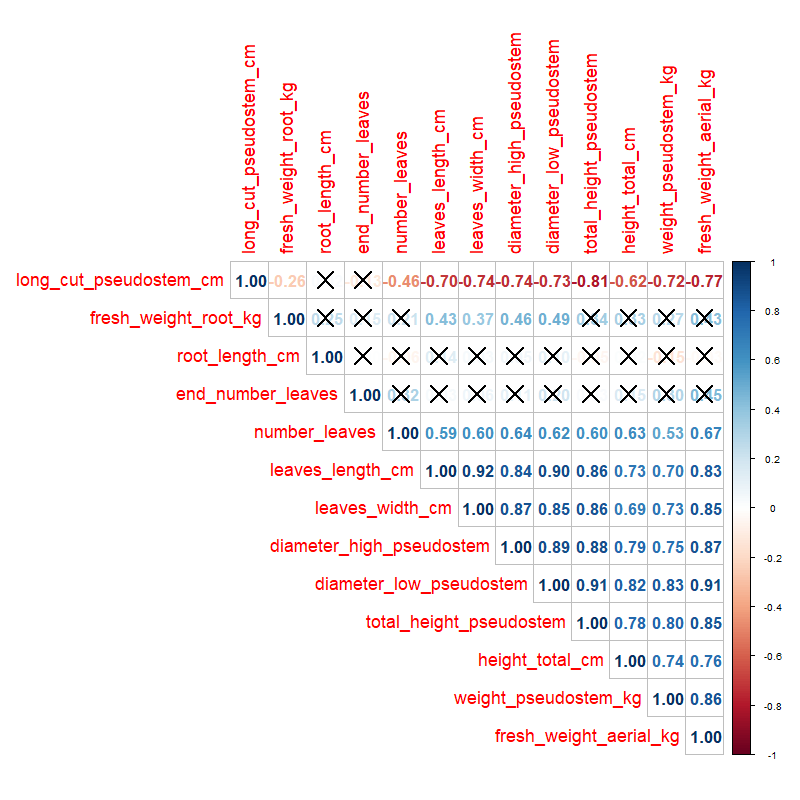
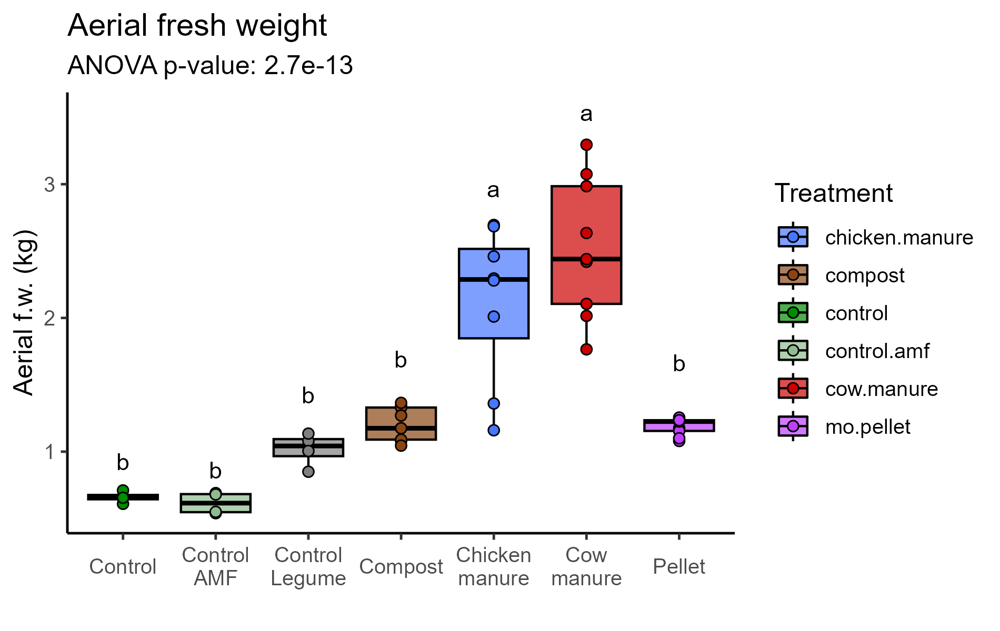
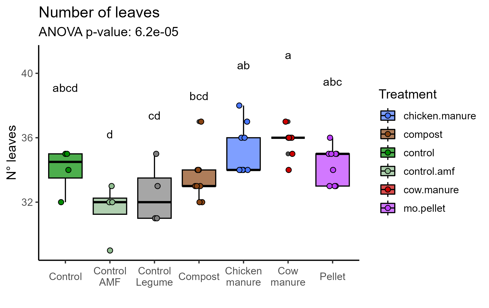
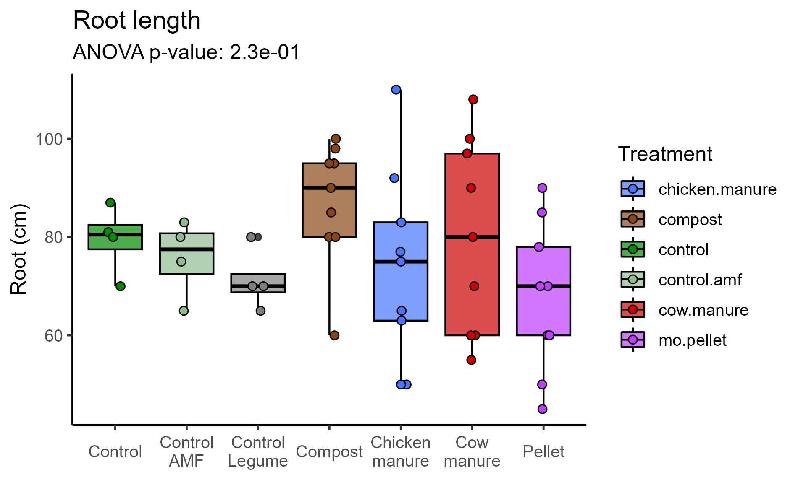
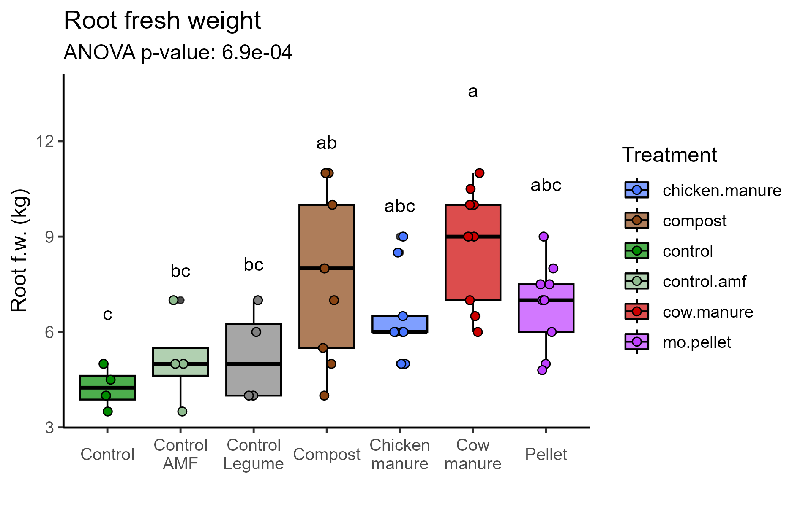
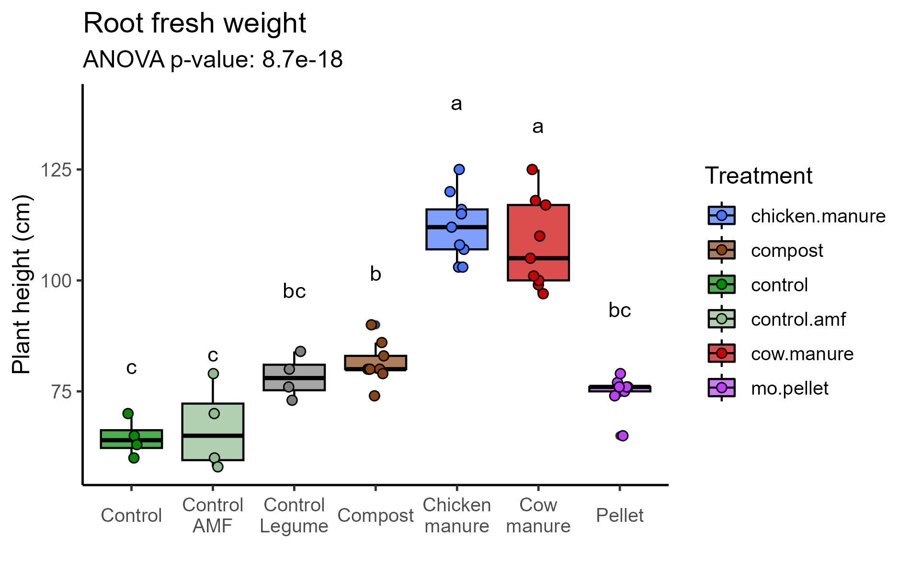
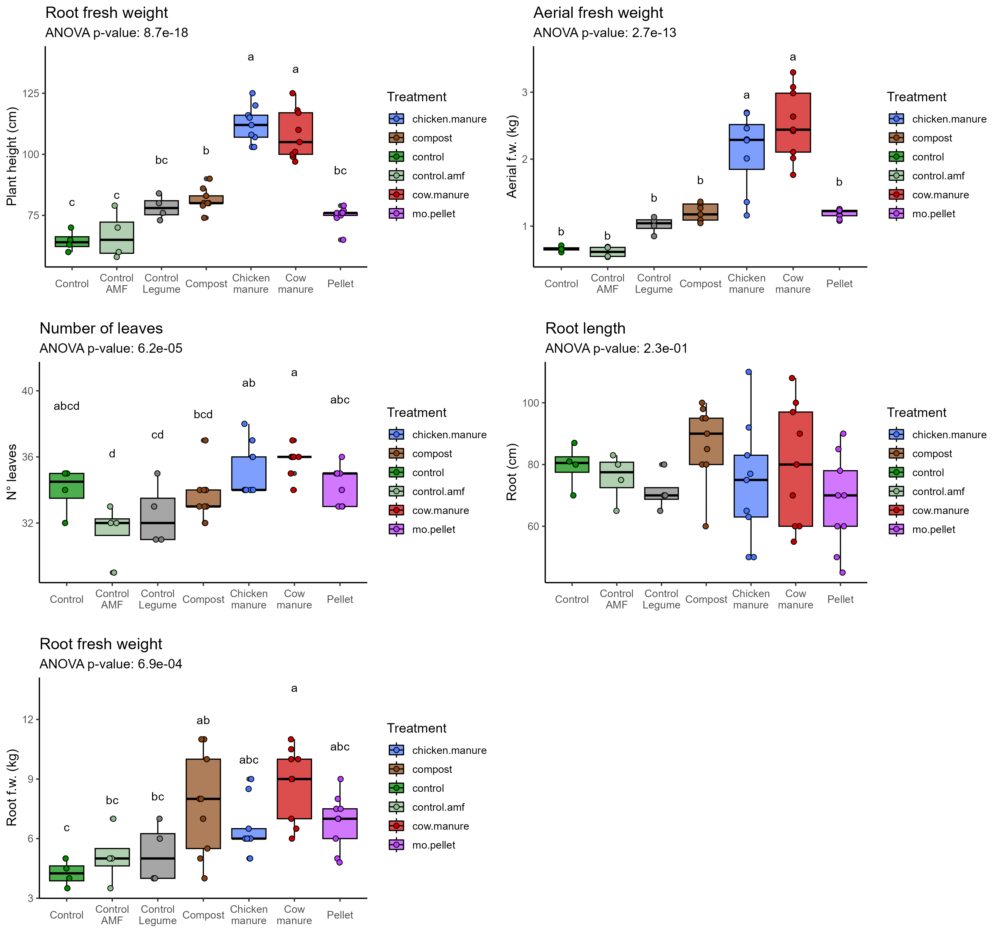

```{r setup, include=FALSE}
knitr::opts_chunk$set(include = TRUE)

```

```{r libraries, include=FALSE}
library(readxl)
library(agricolae)
library(tidyr)
library(tidyverse)
library(ggpubr)
library(rstatix)
library(MASS)
library(dplyr)
library(dunn.test)
library(corrplot)
library(gridExtra)
```

```{r import data}
plant.metrics <- read_excel("raw_files/plant_biometric_parameters.xlsx")
plant.metrics$pot <- as.character(plant.metrics$pot)
```

```{r colors and order, include=FALSE}
treat.colors <- c("control"= "green4" ,"control.amf"  = "darkseagreen" , "chicken.manure"= "royalblue1", "cow.manure" = "red3","mo.pellet"= "darkorchid1","compost"="chocolate4","control.legumes"="darkolivegreen4")

treat.order <- c('control', 'control.amf', 'control.legume', "compost", "chicken.manure", "cow.manure", "mo.pellet") 
treat.labels <- c("Control", "Control\nAMF", "Control\nLegume", "Compost", "Chicken\nmanure", "Cow\nmanure", "Pellet")
```


```{r correlations, include= FALSE}
plant.response <- plant.metrics[-4,-c(1,2,8,13,15)]
cor.matrix <- plant.response %>% cor()
cor.mtest(cor.matrix)

dev.set(1)
png(file="biometric_results/biometrics_corr.png", height = 800, width = 800)
corplot.plant <- corrplot(cor.matrix, p.mat=cor.mtest(cor.matrix)$p, sig.level = 0.05, order= "hclust", type= "upper", method= "number", insig = "pch", pch=4,number.cex = 1.4, tl.cex =1.5)
dev.off()
```



Variables that I consider worth looking into: 

* Aerial fresh weight 
* Root fresh weight
* N° leaves
* Root length
* Total height pseudostem


```{r aerial fw, include= FALSE}
plant.metrics %>% 
  group_by(treatment) %>% 
  shapiro_test(fresh_weight_aerial_kg)
ggqqplot(data= plant.metrics, "fresh_weight_aerial_kg", facet.by = "treatment")

# Data is normal

aov(fresh_weight_aerial_kg~treatment, data= plant.metrics)
aov.aerial.fw <- summary(aov(fresh_weight_aerial_kg~treatment, data= plant.metrics))
pval.aerial.fw <- aov.aerial.fw[[1]][["Pr(>F)"]][1]
tukey.aerial.fw <- HSD.test(aov(fresh_weight_aerial_kg~treatment, data= plant.metrics), "treatment")$groups %>% rownames_to_column(var= "treatment")


plot.aerial.fw <- plant.metrics %>% ggplot(aes(x= factor(treatment, level= treat.order), y= fresh_weight_aerial_kg, fill= treatment))+
  geom_boxplot(col= "black", alpha= 0.7)+
  geom_point(size= 2, pch= 21, col= "black", aes(fill= treatment))+
  scale_fill_manual(values= treat.colors)+
  scale_color_manual(values= treat.colors)+
  theme_classic2()+
  xlab("")+ylab("Aerial f.w. (kg)")+
  scale_x_discrete(labels= treat.labels)+
  theme(axis.text.x = element_text(angle = 0, vjust = 0.5))+
  guides(fill=guide_legend(title="Treatment"))+
  ggtitle("Aerial fresh weight", subtitle= paste("ANOVA p-value: ", format(pval.aerial.fw, scientific= TRUE, digits=2 ), sep= ""))+
  geom_text(data= tukey.aerial.fw, aes(x= treatment, y= 1.4*fresh_weight_aerial_kg, label= groups))
plot.aerial.fw
ggsave(plot.aerial.fw, file="biometric_results/aerial_fw.png", width= 1900,height= 1200, units= "px")
```



```{r leave number exploration, include= FALSE}
plant.metrics %>% 
  group_by(treatment) %>% 
  shapiro_test(number_leaves)
ggqqplot(data= plant.metrics, "number_leaves", facet.by = "treatment")

# Data is normal

aov.nleaves <- summary(aov(number_leaves~treatment, data= plant.metrics))
pval.nleaves <- aov.nleaves[[1]][["Pr(>F)"]][1] %>% format( scientific= TRUE, digits=2 )
tukey.nleaves <- HSD.test(aov(number_leaves~treatment, data= plant.metrics), "treatment")$groups %>% rownames_to_column(var= "treatment")


plot.nleaves <- plant.metrics %>% ggplot(aes(x= factor(treatment, level= treat.order), y= number_leaves, fill= treatment))+
  geom_boxplot(col= "black", alpha= 0.7)+
  geom_point(size= 2, pch= 21, col= "black", aes(fill= treatment), position= position_jitter(width=0.1, height=0))+
  #geom_violin(alpha=0.5)+
  scale_fill_manual(values= treat.colors)+
  scale_color_manual(values= treat.colors)+
  theme_classic2()+
  xlab("")+ylab("N° leaves")+
  scale_x_discrete(labels= treat.labels)+
  theme(axis.text.x = element_text(angle = 0, vjust = 0.5))+
  guides(fill=guide_legend(title="Treatment"))+
  ggtitle("Number of leaves", subtitle= paste("ANOVA p-value: ",pval.nleaves , sep= ""))+
  geom_text(data= tukey.nleaves, aes(x= treatment, y= 1.15*number_leaves, label= groups))
plot.nleaves
ggsave(plot.nleaves, file="biometric_results/number_leaves.png", width= 1900,height= 1200, units= "px")
```



```{r root length exploration, include= FALSE}
plant.metrics %>% 
  group_by(treatment) %>% 
  shapiro_test(root_length_cm)
ggqqplot(data= plant.metrics, "root_length_cm", facet.by = "treatment")

# Data is normal
aov.root.length <- summary(aov(root_length_cm~treatment, data= plant.metrics))
pval.root.length <- aov.root.length[[1]][["Pr(>F)"]][1] %>% format( scientific= TRUE, digits=2 )
tukey.root.length<- HSD.test(aov(root_length_cm~treatment, data= plant.metrics), "treatment")$groups %>% rownames_to_column(var= "treatment")


plot.root.length <- plant.metrics %>% ggplot(aes(x= factor(treatment, level= treat.order), y= root_length_cm, fill= treatment))+
  geom_boxplot(col= "black", alpha= 0.7)+
  geom_point(size= 2, pch= 21, col= "black", aes(fill= treatment), position= position_jitter(width=0.1, height=0))+
  #geom_violin(alpha=0.5)+
  scale_fill_manual(values= treat.colors)+
  scale_color_manual(values= treat.colors)+
  theme_classic2()+
  xlab("")+ylab("Root (cm)")+
  scale_x_discrete(labels= treat.labels)+
  theme(axis.text.x = element_text(angle = 0, vjust = 0.5))+
  guides(fill=guide_legend(title="Treatment"))+
  ggtitle("Root length", subtitle= paste("ANOVA p-value: ",pval.root.length, sep= ""))#+
  #geom_text(data= tukey.root.length, aes(x= treatment, y= 1.55*root_length_cm, label= groups))
plot.root.length
ggsave(plot.root.length, file="biometric_results/root_length.png", width= 1900,height= 1200, units= "px")
```



```{r root fw exploration, include= FALSE}
plant.metrics %>% 
  group_by(treatment) %>% 
  shapiro_test(fresh_weight_root_kg)
ggqqplot(data= plant.metrics, "fresh_weight_root_kg", facet.by = "treatment")

# Data is normal

aov.root.fw <- summary(aov(fresh_weight_root_kg~treatment, data= plant.metrics))
pval.root.fw<- aov.root.fw[[1]][["Pr(>F)"]][1] %>% format( scientific= TRUE, digits=2 )
tukey.root.fw<- HSD.test(aov(fresh_weight_root_kg~treatment, data= plant.metrics), "treatment")$groups %>% rownames_to_column(var= "treatment")


plot.root.fw <- plant.metrics %>% ggplot(aes(x= factor(treatment, level= treat.order), y= fresh_weight_root_kg, fill= treatment))+
  geom_boxplot(col= "black", alpha= 0.7)+
  geom_point(size= 2, pch= 21, col= "black", aes(fill= treatment), position= position_jitter(width=0.1, height=0))+
  #geom_violin(alpha=0.5)+
  scale_fill_manual(values= treat.colors)+
  scale_color_manual(values= treat.colors)+
  theme_classic2()+
  xlab("")+ylab("Root f.w. (kg)")+
  scale_x_discrete(labels= treat.labels)+
  theme(axis.text.x = element_text(angle = 0, vjust = 0.5))+
  guides(fill=guide_legend(title="Treatment"))+
  ggtitle("Root fresh weight", subtitle= paste("ANOVA p-value: ",pval.root.fw, sep= ""))+
  geom_text(data= tukey.root.fw, aes(x= treatment, y= 1.55*fresh_weight_root_kg, label= groups))
plot.root.fw
ggsave(plot.root.fw, file="biometric_results/root_fw.png", width= 1900,height= 1200, units= "px")
```



```{r height exploration, include= FALSE}
plant.metrics %>% 
  group_by(treatment) %>% 
  shapiro_test(total_height_pseudostem)
ggqqplot(data= plant.metrics, "total_height_pseudostem", facet.by = "treatment")

# Data is normal

aov.height <- summary(aov(total_height_pseudostem~treatment, data= plant.metrics))
pval.height <-  aov.height[[1]][["Pr(>F)"]][1] %>% format( scientific= TRUE, digits=2 )
tukey.height<- HSD.test(aov(total_height_pseudostem~treatment, data= plant.metrics), "treatment")$groups %>% rownames_to_column(var= "treatment")


plot.height <- plant.metrics %>% ggplot(aes(x= factor(treatment, level= treat.order), y= total_height_pseudostem, fill= treatment))+
  geom_boxplot(col= "black", alpha= 0.7)+
  geom_point(size= 2, pch= 21, col= "black", aes(fill= treatment), position= position_jitter(width=0.1, height=0))+
  #geom_violin(alpha=0.5)+
  scale_fill_manual(values= treat.colors)+
  scale_color_manual(values= treat.colors)+
  theme_classic2()+
  xlab("")+ylab("Plant height (cm)")+
  scale_x_discrete(labels= treat.labels)+
  theme(axis.text.x = element_text(angle = 0, vjust = 0.5))+
  guides(fill=guide_legend(title="Treatment"))+
  ggtitle("Root fresh weight", subtitle= paste("ANOVA p-value: ",pval.height, sep= ""))+
  geom_text(data= tukey.height, aes(x= treatment, y= 1.25*total_height_pseudostem, label= groups))
plot.height
ggsave(plot.height, file="biometric_results/height.png", width= 1900,height= 1200, units= "px")
```



```{r exploration multiplot, include= FALSE}
plots.plant.metrics <- grid.arrange(plot.height, plot.aerial.fw, plot.nleaves, plot.root.length, plot.root.fw)
ggsave(plots.plant.metrics, file="biometric_results/plant_metrics.png", width= 3800, height= 3600, units= "px")
```


